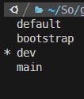
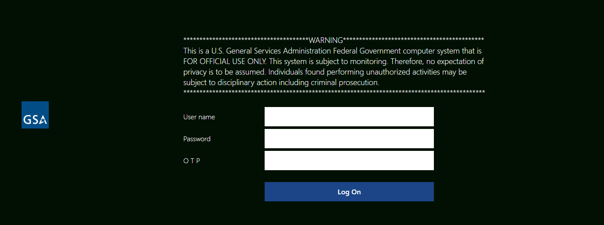
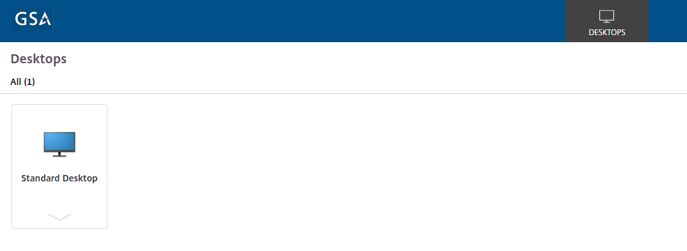

# Benefit Finder v2

[Jump to Getting Started](#getting-started)

## Synopsis

Benefit Finder v2, is built as a progressively decoupled JavaScript application that is designed to be integrated as a custom module within the USAGov Drupal CMS.

## Tech Resources

A short list of technologies used in this project.

### Devops

- [Git](https://git-scm.com/) - Version control system
- [Github](https://github.com/) - Git repository management
- [CircleCI](https://circleci.com/) - Continuous Integration and delivery
- [Github Actions](https://github.com/features/actions) - Continuous Integration and delivery
- [Terraform](https://www.terraform.io/) - Infrastructure automation to provision and manage resources in any cloud or data center
- [Docker](https://www.docker.com/) - Build, Share, Run containerized applications
- [Cloud.gov](https://cloud.gov/) - Environment Platform
- [CodeQL](https://codeql.github.com/) - Semantic code analysis engine
- [Dependabot](https://github.com/dependabot) - Dependency vulnerability monitoring
- [Snyk](https://snyk.io/) - Scans for vulnerabilities in dependencies and containers
- [Lint](https://github.com/topics/lint) - Static code analysis tool
- [Terraform](https://www.terraform.io/) - Infrastructure as Code

### BackEnd

- [Drupal](https://www.drupal.org/) - Open-source Content Management System (CMS)
- [PHP](https://www.php.net/) - Hypertext Preprocessor
- [Twig](https://twig.symfony.com/) - PHP template engine

### FrontEnd

- [React](https://react.dev/) - Javascript library for web and native user interfaces
- [Vitest](https://vitest.dev/) - Javascript testing framework
- [USWDS](https://designsystem.digital.gov/) - United States Web Design System
- [SCSS](https://sass-lang.com/) - CSS Extension
- [Vite](https://vitejs.dev/) - Module bundler
- [Storybook](https://storybook.js.org/) - Front End workshop for UI development

### Automated Testing

- [Cypress](https://www.cypress.io/) - E2E testing framework

## Getting Started

> Detailed README(s) for the [drupal module](./usagov_benefit_finder/README.md) or the [JS application](./benefit-finder/README.md)

### How to Clone the `px-benefit-finder` Repository with `usagov-2021` Submodule

This guide will walk you through the process of cloning the `px-benefit-finder` repository that includes a submodule.

> Submodules are repositories embedded within another repository, allowing you to include external dependencies or shared code as part of your project. When you clone such a project, by default you get the directories that contain submodules, but none of the files within them yet.

To clone the repository with a submodule, follow these steps:

1. Open your command line or terminal.

2. Navigate to the directory where you want to clone the repository. You can use the cd command to change directories. For example, cd Documents/Projects.

3. Use the following command to clone the main repository:

```
git clone git@github.com:GSA/px-benefit-finder.git
```

4. Once the cloning process completes, navigate into the cloned repository's directory using the cd command.

```
cd px-benefit-finder
```

5. usagov-2021 directory is there but empty. You must run the following two commands to initialize your local configuration file and fetch all the data from that project.

```
git submodule init
git submodule update
```

6. You have now successfully cloned the repository with a submodule. You can work with the main repository and its submodule as separate entities.

7. If you've already cloned a repository with submodules and want to update them, follow these steps:

   a. Navigate to the main repository's directory using the command line.
   b. Run the following command to update the main repository along with its submodules:

```
git pull --recurse-submodules
```

This command updates the main repository and its submodules to the latest commit.

### Local Development Environment

#### Get USAgov code

```
git clone git@github.com:usagov/usagov-2021.git poc
cd poc
```

#### Get USAgov code

Set up local development site following README.md.

#### Get a Database Dump

1. Make sure you login cloud.gov on your terminal and target your org and space.

```
cf login -a api.fr.cloud.gov --sso
```

2. Change directory to where the script lives.

```
cd bin/cloudgov
```

4. Set `env` variable depending on your space; `main` or `dev`. This is required by the script.

```
export env=dev  or export env=main
```

4. Execute the following script.

```
./db-backup.sh
```

### How to use awscli commands for s3

1. Make sure you login cloud.gov on your terminal and target your org and space.

```
cf login -a api.fr.cloud.gov --sso
```

2. Change directory to where the script lives.

```
cd bin/cloudgov
```

3. Export the bucket name in your terminal

```
export bucket_name=storage or export bucket_name=dbstorage
```

4. Execute the following script. Make sure you `source` it!

```
source ./cloudgov-aws-creds.sh
```

5. If you see the script finds a key and deletes it; make sure you run it again to create the key again. If the script finds a key, it will delete it.

You'll see either of the below messages after running it.

```
Getting bucket credentials...
Key found. Deleting...

or

Getting bucket credentials...
Key not found. Creating...
```

6. Start using `aws s3` commands like below:

```
aws s3 ls s3://${AWS_BUCKET}/
```

7. Run it again after using it to delete the service-key.

# Infrastructure (provisioned by Terraform)

## Cloud.gov Infrastructure

### Environments/Spaces:

#### Benefit-finder-dev : Sandbox environment for the tech team.

      CMS App main page URL:

      https://bf-static-main.bxdev.net/

#### Benefit-finder-main : The main/pre-release environment.

      CMS App main page URL:

      https://bf-static-dev.bxdev.net/

## How to use terraform to manage the infrastructure

1. Make sure you login cloud.gov on your terminal and target your org and `benefit-finder-dev` space

```
cf login -a api.fr.cloud.gov --sso
```

2. Change directory to infra/benefit-finder-infra directory.

```
cd infra/benefit-finder-infra
```

3. Set bucket_name variable.

```
export bucket_name="terraform-backend"
```

4. Execute the script to authenticate to use terraform backend

```
source scripts/cloudgov-aws-creds.sh
```

5. Get `terraform.tfvars` file in a secure way and put it in the `infra/benefit-finder-infra` directory.

6. Initialize your local terraform folder.

```
terraform init
```

7. Make sure you see terraform workspaces

```
terraform workspace list
```



8. Choose the workspace you need to work on

```
terraform workspace select dev
```

9. Plan

```
terraform plan
```

# Release Process

### Versioning

The versioning scheme adheres to Semantic Versioning (SemVer). Versions are of the form MAJOR.MINOR.PATCH:

We are currently in the beta stage. An example of our release tag is [](https://github.com/GSA/px-benefit-finder/releases/latest).

### Branching Strategy

The development process involves three main branches:

1. `release`: Represents the latest stable release. No direct commits are made to this branch.

2. `main`: Serves as the integration branch for ongoing development.

3. Feature Branches: These are created for each new feature or bug fix. They can be deployed to the cloud.gov `benefit-finder-dev` environment by altering the branch name which the `build_and_deploy_dev` CircleCI workflow deploys on.

### Pull Request Workflow

All changes are made through feature branches, and pull requests to `main` are submitted for code review. A minimum of one approving review is required before merging.

There are following automated tests that get triggered on each PR and need to pass:

1. PHP Code Sniffer
2. CodeQL
3. Cypress Tests
4. Snyk Scanning
5. Frontend Testing

### Release Candidate

When `main` is deemed stable, a `pre-release draft` is created as below:

1. Navigate to the repository.
2. Go to the "Actions" Tab and click on it.
3. From the list of workflows on the left, choose the `Create release` workflow to run manually.
4. On the right-hand side, you should see a "Run workflow" button.
5. Use workflow from `Branch:main`
6. Enter the tag/version you would like to publish. You may check the earlier versions published in the `Releases` sections by clicking on it on the right buttom of the repository. An example of our release tag is `v0.1.2.beta.1`.
7. After completing the 5th and 6th steps, click the "Run workflow" button to trigger the workflow manually.
8. Once the workflow runs successfully, a `draft pre-release` is created, automated release notes are generated and a `benefit-finder-module-*.tar.gz` file is output under the `assets` section of the release.
9. Edit the `draft pre-release`, evaluate the notes and publish it as the `release` or `pre-release`.

# VDI Login Guide for the Benefit-finder Team Members

## What is VDI?

The Virtual Desktop Infrastructure (VDI) is a technology that allows you to access a remote desktop environment from your local device. This is particularly useful for accessing GSA resources and applications securely from outside the GSA network.

### Steps to Login

1. Access https://secureauth.gsa.gov/secureauth14/, authenticate yourself with your GSA Credentials and get the TOKEN provided.

2. In a different browser, access the Citrix VDI at https://vdi.anywhere.gsa.gov/ and make sure see the below screen:



3. Enter your GSA Username and Password as well as the TOKEN you get from the 1st step above.

4. The VDI Desktops you have available will be presented to you after you successfully login. Click on the monitor icon for the VDI desktop you wish to launch.



5. You will notice a file downloaded in your browser. Click on the ^ to the right of the file name and select `Always open files of this type`.

6. Click on the monitor icon for the Desktop you want to launch. This time (and going forward) the Desktop should launch without showing a downloaded file.

### Additional Info

You may get additional information about the VDI and the Citrix (a Windows virtual desktop client) app from the TTS Handbook at https://handbook.tts.gsa.gov/tools/virtual-desktop/.

### Tips

To move files between your laptop and your Citrix desktop, use Google Drive. You can use Chrome in the Citrix desktop to download and upload files.

## Accessibility Statement

We are committed to making our application accessible to all visitors. Our ongoing accessibility effort works towards conforming to Web Content Accessibility Guidelines (WCAG) version 2.1, level AA criteria and by performing regular automatic and manual testing audits.
